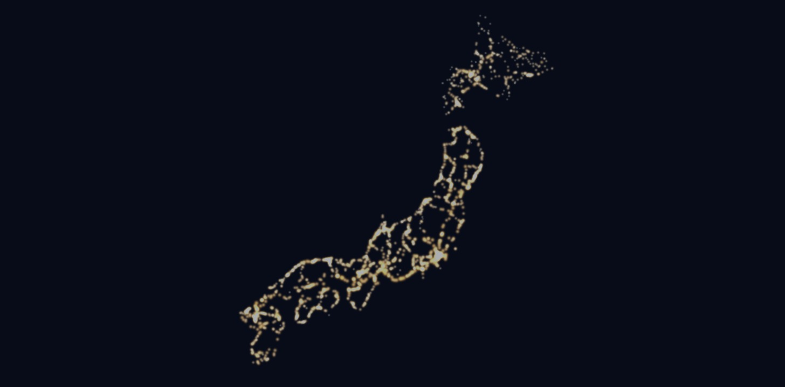
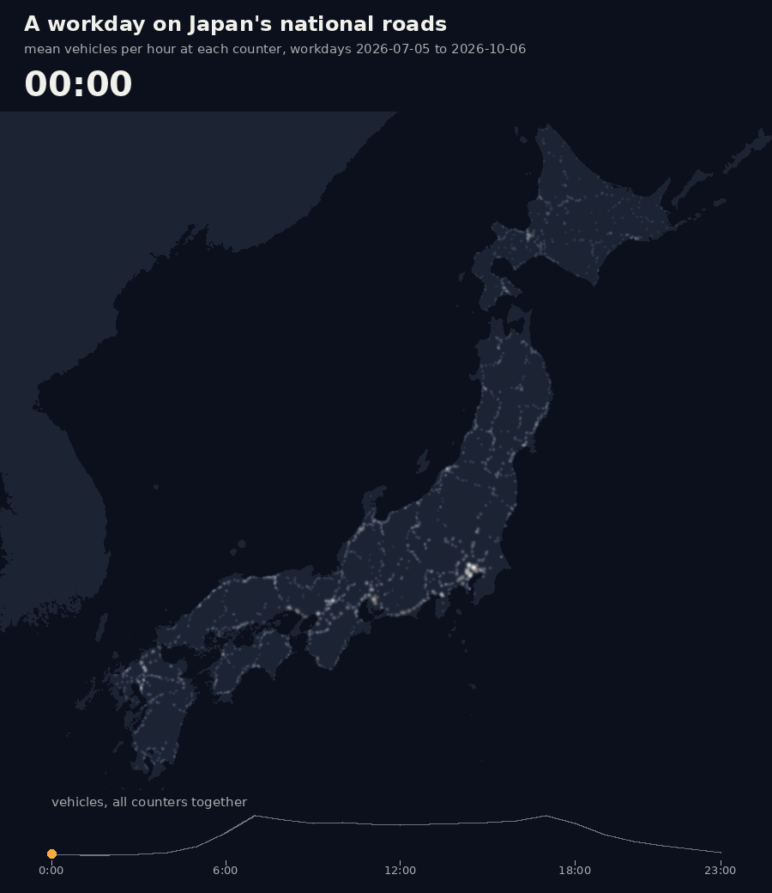
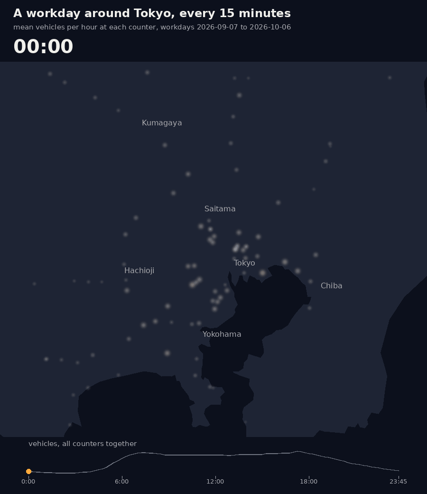
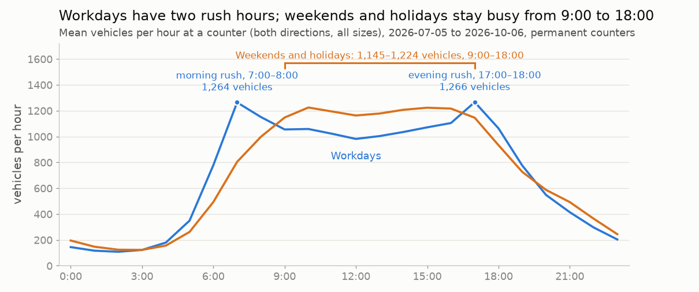
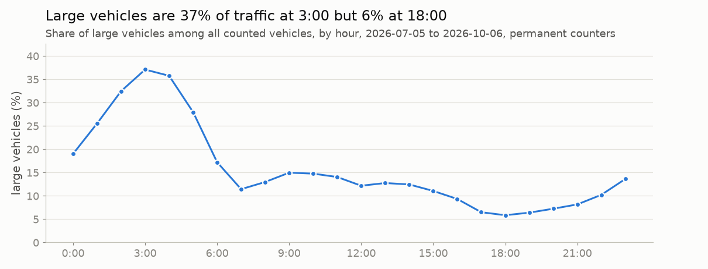
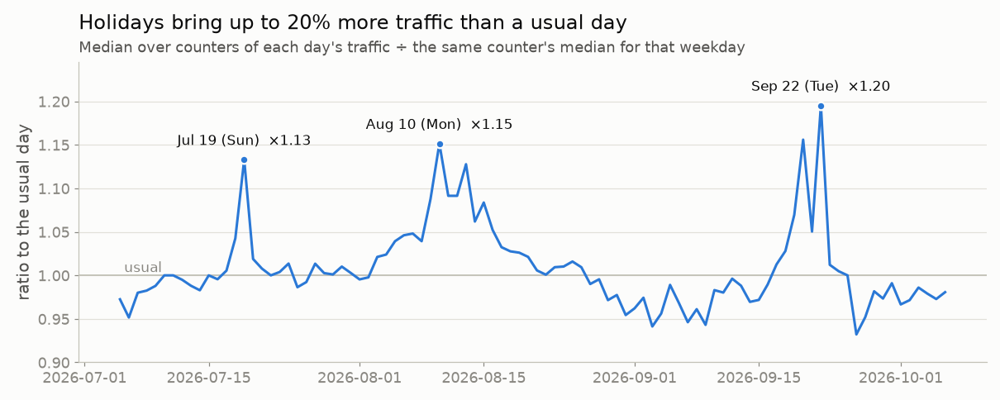
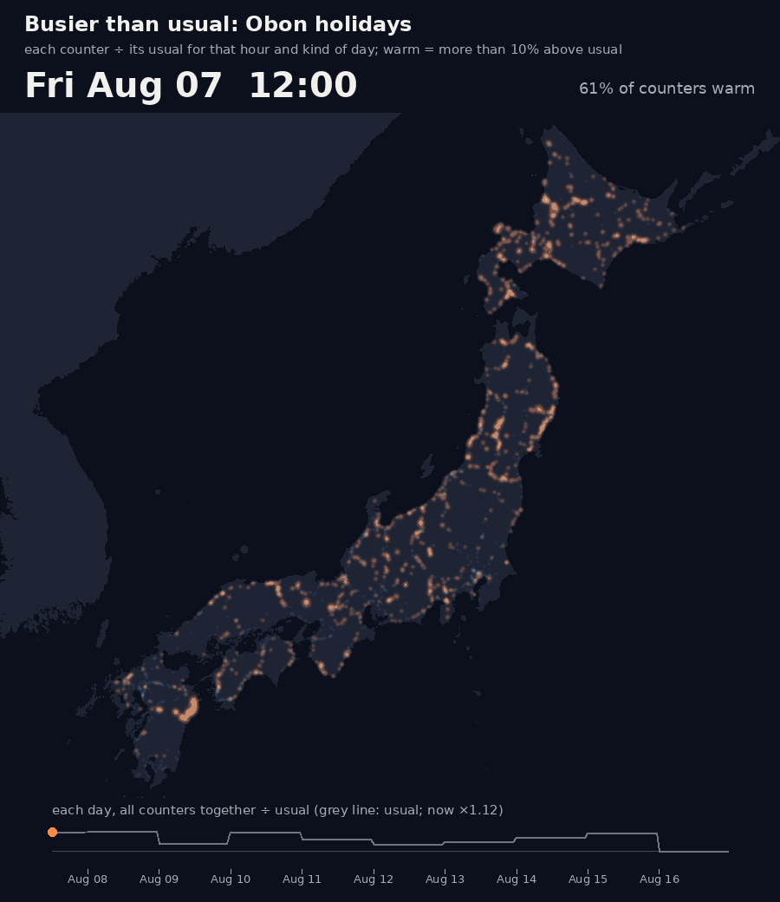
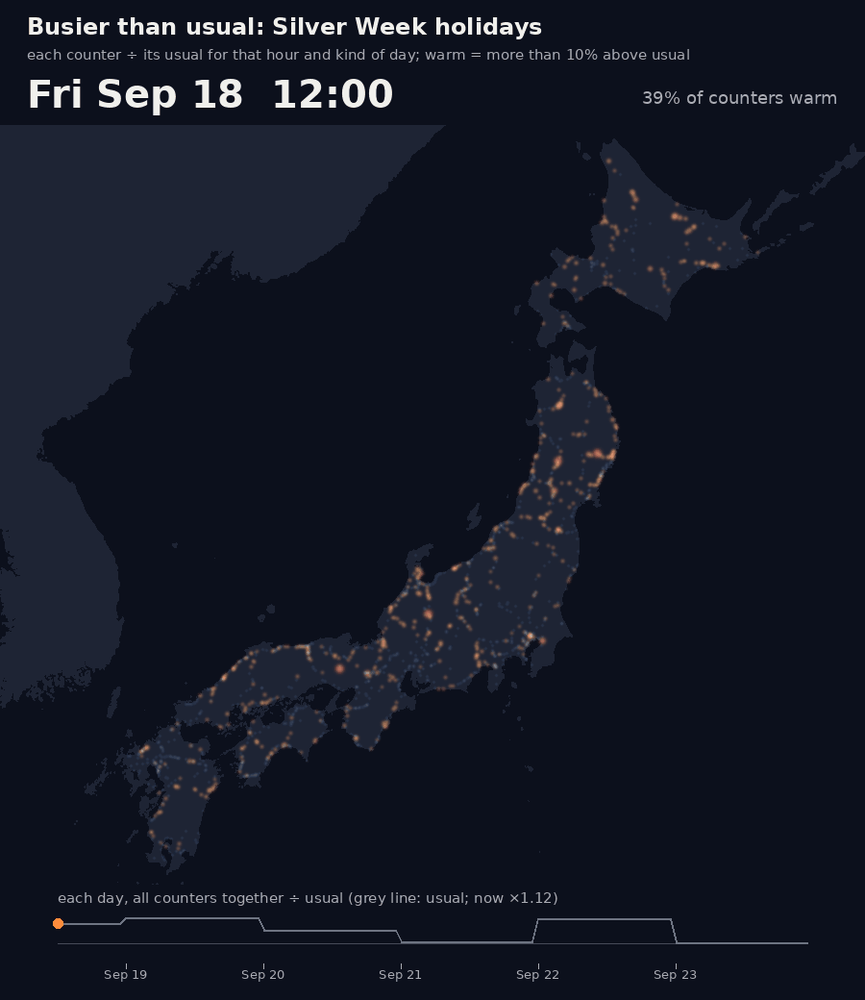

# Japan Road Traffic Volume (daily archive)

Vehicle counts from the traffic counters of Japan's Ministry of Land, Infrastructure, Transport and Tourism (MLIT) on national highways and expressways, collected every day and kept.

- **Nationwide, hourly**: permanent counters and AI counters on CCTV images, both directions, small and large vehicles (on 2026-10-05: 993 permanent and 981 CCTV counters on national highways; 76 permanent and 1 CCTV counter on expressways).
- **Kanto, every 5 minutes**: the same kinds of counters inside the box longitude 138.4–140.95, latitude 34.85–37.2 (Tokyo, Kanagawa, Saitama, Chiba, Ibaraki, Tochigi, Gunma, and the edges of neighbouring prefectures).

The source API only keeps **5-minute values for about one month and hourly values for about three months**. Older values are gone from the source, so this archive is the only place they remain.

**Kaggle**: [Japan Road Traffic Volume (Hourly Archive)](https://www.kaggle.com/datasets/yasunorim/japan-road-traffic-volume) (Parquet, updated daily) · notebook: [a first look](https://www.kaggle.com/code/yasunorim/japan-road-traffic-a-first-look)

The Kaggle files are ready to use: `vehicles` per row for both kinds of counter (empty for hours a counter flags as faulty), `weekday`, `is_holiday` (Japanese national holidays), and prefecture and municipality names in English as well as Japanese (`prefecture_en`; `municipality_en` in `counters.csv`, e.g. Yokohama-shi Tsurumi-ku).

## What the data shows

The figures below are drawn from the archive by `scripts/figures.py`, `scripts/cover.py` and `scripts/animate.py`; the charts are redrawn every ten days and the animated maps every month. They drop rows the source flags as faulty or missing; the charts use permanent counters only.

Every counter on one day, as a point of light at its location: the national highway network appears by itself.

A workday, hour by hour (mean over workdays): the roads wake up around 6:00 and fade after 19:00; at 3:00 the brightest points are around Tokyo and Nagoya.

The same around Tokyo every 15 minutes, from the five-minute counts.

<picture>
  <source media="(prefers-color-scheme: dark)" srcset="docs/figures/day_shape_dark.png">
  
</picture>

Workdays have a morning and an evening rush; weekends and holidays have no rush hours but stay busy all day.

<picture>
  <source media="(prefers-color-scheme: dark)" srcset="docs/figures/large_share_dark.png">
  
</picture>

Large vehicles make up a much larger share of traffic at night.

<picture>
  <source media="(prefers-color-scheme: dark)" srcset="docs/figures/vs_usual_dark.png">
  
</picture>

Each day compared with the same weekday at the same counter: holiday periods rise well above the usual level.

The Obon holidays (August 2026), every two hours: each counter against its own usual for that hour and kind of day. Orange counters carry more than 10% above usual. From 8:00 to 20:00 on August 8–16, 58% of the counter-hours outside the Tokyo area (longitude 139.0–140.3, latitude 35.2–36.2) were orange, against 14% inside it: most of the country gets busier while traffic around Tokyo stays near its usual level (median ×0.97). On August 8 the source has no CCTV counts, so that day shows permanent counters only. This is traffic volume, not congestion: the source has no speeds.

The same for the September 2026 holidays (Silver Week).

Land outlines: [Natural Earth](https://www.naturalearthdata.com/) (public domain).

## Why this exists

Japan's Ministry of Land, Infrastructure, Transport and Tourism (MLIT) opened this API in May 2025, but it is a rolling window. There is no long history to study weekday patterns, holidays (Golden Week, Obon, New Year), weather, or events. This repository collects every day so that history builds up.

## Files

Every day is stored as release assets in the release `raw-YYYYMM` (JST month):

| asset | contents |
|---|---|
| `loop_1h_road3_YYYYMMDD.csv.gz` | hourly, permanent counters, national highways (一般国道) |
| `cctv_1h_road3_YYYYMMDD.csv.gz` | hourly, AI counters on CCTV images, national highways |
| `loop_1h_road1_…` / `cctv_1h_road1_…` | hourly, expressways (高速自動車国道) with MLIT counters |
| `loop_5m_road3_…` / `cctv_5m_road3_…` / `loop_5m_road1_…` | 5-minute, Kanto box (there are no CCTV counters on expressways in this box, so there is no `cctv_5m_road1`) |

Columns are the source's own names (Japanese), plus longitude and latitude. Each layer has its own field names
(`scripts/fetch.py` holds the three lists); all of them start with:

| column | meaning |
|---|---|
| 時間コード | start of the interval, JST, `YYYYMMDDhhmm` (code 0905 is 09:05–09:09 in the API specification) |
| 常時観測点コード | counter ID |
| 道路種別 | 1 = expressway, 3 = national highway |
| 地方整備局等番号 | regional bureau (81 Hokkaido … 90 Okinawa) |
| 開発建設部／都道府県コード | sub-region (Hokkaido and Chubu only) |
| 経度 / 緯度 | counter location (WGS84), last two columns |

- **Permanent counters (`loop_*`)**: 上り・小型交通量 / 上り・大型交通量 / 上り・車種判別不能交通量 (vehicles in the interval, "up" direction: small / large / unclassified) and the flags 上り・停電 / 上り・ループ異常 / 上り・超音波異常 / 上り・欠測 (1 = power failure / loop fault / ultrasonic fault / missing); the same for 下り ("down").
- **CCTV, hourly (`cctv_1h_*`)**: 上り・自動車交通量 (all vehicles), 上り・小型交通量, 上り・大型交通量, 上り・小型大型判別不能交通量, and 上り・5分欠測処理フラグ (API specification: 1 = "5-minute processing", 2 = "1 hour"; 0 also occurs and is not defined there); the same for 下り.
- **CCTV, 5-minute (`cctv_5m_*`)**: the same counts with the suffix （集計値）, plus camera status fields (カメラプリセット位置, 気象影響による映像不良, 照度不足, 突発事象（交通事故等）, サーバの稼働, カメラの映像受信, 映像のデコード処理, デコード映像から映像解析機能への取込加工処理の失敗, 映像解析機能のフリーズ, その他エラー: 0 = normal, 1 = abnormal, blank = could not be judged).

CCTV counts are often blank. In the September 2026 five-minute data 28% of CCTV rows have no counts (the specification blanks them when the camera is off its preset position, 19% of rows, but 9% are blank with the camera at its preset); in the July 2026 hourly data 39% are blank, and where filled the total differs from small + large + unclassified in 1.4% of rows. Permanent-counter rows are almost always filled.

Files collected before 2026-10-06 (commit `906b6d6`) used the permanent-counter field names for the CCTV layers and lost their counts. Those files were deleted and the CCTV days are being fetched again while the source still holds them (from 2026-07-05 hourly and 2026-09-05 five-minute).

`data/counters.csv` lists every counter (ID and sensor) seen in the API or in the archive, with its location, the prefecture, municipality and town at that point from the GSI reverse geocoder (出典：国土地理院), and `last_seen`, the latest day it reported. A counter that stops reporting keeps its row. The API gives no road or place names. Two counters got no municipality from the geocoder.

## Caveats

- These are counts, not speeds. Congestion has to be inferred, for example by comparing a count with the same weekday and hour.
- The values are reference values, not official MLIT traffic survey results. Some counters are unpublished at times because of faults.
- A permanent counter that fails reports 0 vehicles with a fault or missing flag (in the archive through 2026-10-05, 11,782 of the 17,652 zero-count rows carry a flag; one counter reads 0 with every hour flagged from late July). Drop flagged rows before using the counts (in the Kaggle files, `vehicles` is already empty for them).
- The API does not give road names, and route numbers are not added here: the only route-name sources found were non-commercial (National Land Numerical Information, emergency transport roads) or share-alike (OpenStreetMap). Place names come from the location.

## How it is collected

`.github/workflows/collect.yml` runs three times a day. `scripts/collect.py` lists the days the source still holds but the releases do not have, fetches them one request at a time with a pause between requests, and uploads a file when every time code of the day is present (24 hourly or 288 five-minute codes). The source itself lacks a few time codes on many days (for example 287 of 288 five-minute codes; asking again returns nothing), so a day older than yesterday with at most 5% of its codes missing is uploaded as it is. A time code with far fewer counters than the rest of the day counts as missing. A day with a larger gap is retried, and kept as it is only when it is about to leave the source window and still has rows; days about to leave the source are fetched first, then the newest days. A missing time code means the source has no value for it. A missed run is recovered by the next one while the day is still in the source window.

## Kaggle dataset

`.github/workflows/publish.yml` runs after each collect run. It lists the release assets with their sha256, and when the list differs from `data/published_assets.txt` it downloads them, adds new counters to `data/counters.csv` (`scripts/build_counters.py --from-files`), writes one Parquet file per ten days and resolution with English column names (`scripts/build_kaggle.py`: `hourly_YYYY-MM_DD-DD.parquet`, `five_minute_kanto_YYYY-MM_DD-DD.parquet`, plus `counters.csv`; Kaggle's preview failed on monthly files of 1.1 million rows and more), and writes the metadata (`scripts/make_kaggle_meta.py`, which stops if a column has no description). It publishes a new version of [yasunorim/japan-road-traffic-volume](https://www.kaggle.com/datasets/yasunorim/japan-road-traffic-volume) only when the repository variable `KAGGLE_PUBLISH` is `true` (a manual run with `publish` always does), and records the list as published only after Kaggle reports the new version ready. The Kaggle files also carry derived columns: `up_vehicles` / `down_vehicles` / `vehicles` (one column for both sensors, empty when a permanent counter flags a fault), `flagged`, `weekday`, `is_holiday` (national and substitute holidays from `data/holidays_jp.csv`, taken from the Cabinet Office list: 出典：内閣府ホームページ「国民の祝日について」（公共データ利用規約 第1.0版）を加工して作成; the build stops when the data reaches a year the list does not cover) and `prefecture` / `prefecture_en`. The published `counters.csv` adds `prefecture_en` and `municipality_en` (e.g. Yokohama-shi Tsurumi-ku) from `data/municipalities_en.csv`, made by `scripts/make_municipalities_en.py` from the MIC local government code list (出典：「全国地方公共団体コード」（総務省）（https://www.soumu.go.jp/denshijiti/code.html）を加工して作成, for the type of municipality) and Wikidata's English labels (CC0, for the name); town names stay in Japanese. Column descriptions for the dataset page are in `kaggle/settings.json`; the cover image is drawn from the data by `scripts/cover.py`.

## Source and terms

出典：「交通量 API（国土交通省）機能による交通量(参考値)」を加工して作成
（データ提供：公益財団法人日本道路交通情報センター https://www.jartic-open-traffic.org/ ）

Traffic volume data from the MLIT Traffic Volume API (reference values), provided by the Japan Road Traffic Information Center (JARTIC), processed by this repository. The JARTIC terms state compatibility with CC BY 4.0. This archive is not made or endorsed by MLIT or JARTIC.

Code: MIT License.
